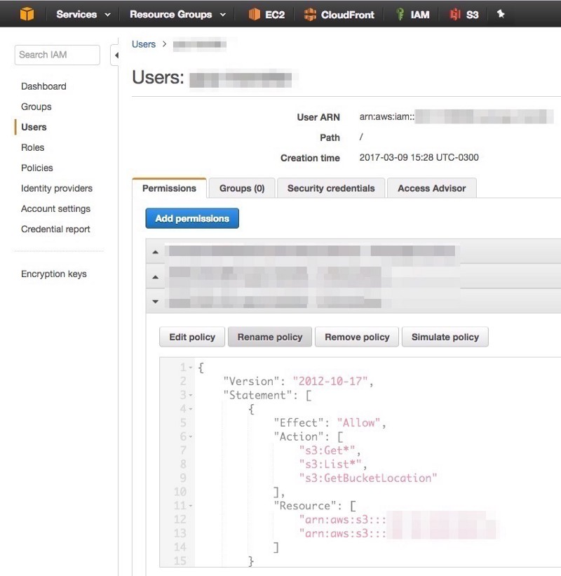

)\], via Wikimedia Commons](./asset-1.jpeg)

I have a SaaS product that consists of a multi-tenant RoR Web App. It is backed by MySQL DB and stores files in S3 buckets, serving content over CloudFront for improved performance.

Every day, a database dump is created for every tenant, zipped and uploaded to a bucket in S3. I know what you are thinking, and yes, I may loose up to 24 hours of data. The current usage of this app makes this scenario a minor risk. But at least I test, every now and then, to check that DB backups are actually able to be used to recreate the database schemas and that the data is not corrupted. [Lesson learned](https://marco.org/2017/02/01/db-backup-testing).

Some tenant database dumps have around 3 GB of compressed size on disk. Objects stored on each S3 bucket come up to 1 million in some cases, and keep growing every day.

For some time, this was my entire disaster recovery strategy: use DB backups in S3 to deploy a new server instance. I had convinced myself that [AWS S3 would never fail](https://www.infoq.com/news/2017/03/aws-s3-disruption), at least not indefinitely, loosing my data for ever. Downloading all the files to a local storage was not an option.

But what if I or someone else deleted all the S3 files by error? Worst, what if it was done on purpose and also my live DB instance was destroyed? Or if I lost access to my AWS account?

The solution was using [Google Cloud Storage](https://cloud.google.com/storage/) to automatically make copies of the DB backups and mirror the file storage buckets for each tenant on a daily basis.

Google Cloud Storage has an easy to setup Transfer feature that allows scheduling daily transfers from a variety of sources, including S3.


To make this work, you need to create a destination bucket on Google Cloud Storage, and an IAM user on your AWS account, granting permissions to read and list files in the source bucket.



Make sure you choose a location for your destination bucket that is close to your AWS source bucket.

Your destination bucket can be created using Coldline as the default storage class. This means files are rarely accessed and will [decrease costs](https://cloud.google.com/storage/docs/storage-classes).

I also configured my bucket’s [lifecycle](https://cloud.google.com/storage/docs/lifecycle) policy to delete files older than 30 days for the database backups. To do this, I had to use the [gsutil tool](https://cloud.google.com/storage/docs/gsutil) and create a JSON file with the desired configuration.

The configuration is applied by running the following command.

```
gsutil lifecycle set del_files_older_than_30_days.json gs://mybucket
```

With this transfer jobs in place I now know that if I loose access to my AWS account and running instances, at least I will be able to deploy to a new server in any other PaaS or IaaS provider with up to date data.
