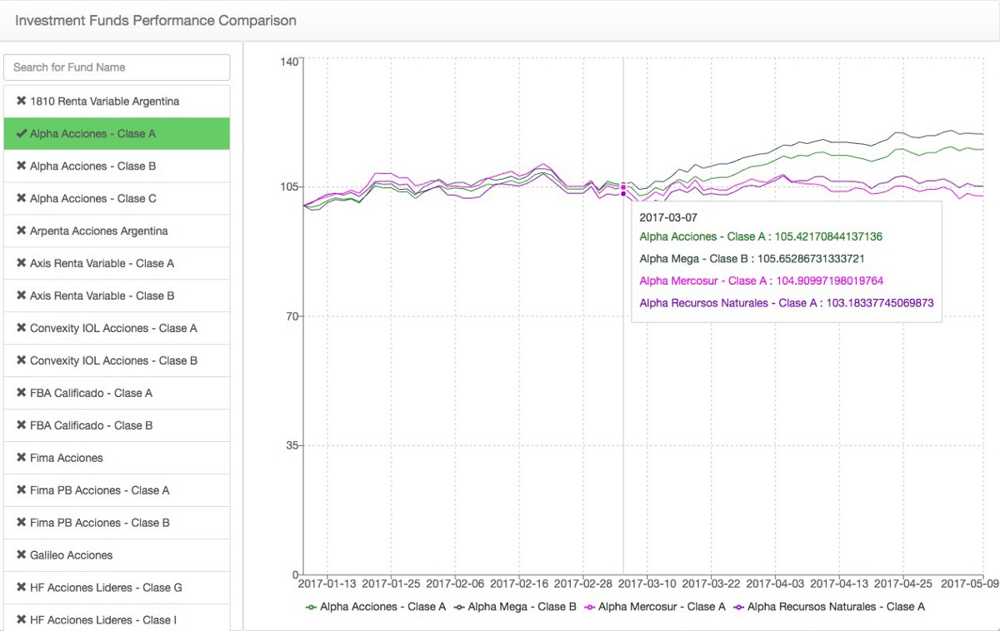
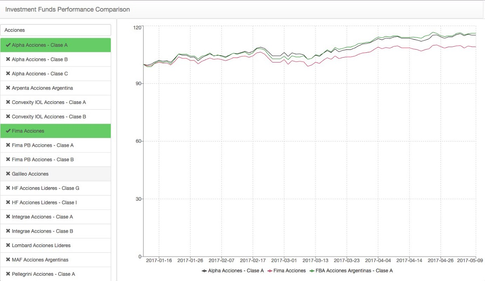

The Buenos Aires Stock Market (BCBA — MERVAL) has been enjoying some good times in the past months, hitting record high.

](./asset-2.jpeg)

An easy way to jump on this trend and make some profit, with little to moderate risk, is to put some savings into an Investment Fund.

But how can one get a quick, easy, visual comparison of the available funds performance? Each bank or investment institution publishes their figures through their own webpages, using different formats, PDF files, tiny charts and technical terms that one needs to learn.

Luckily, there is a [website for the Argentinean Chamber of Investment Funds](http://cafci.org.ar/) that provides the information for (almost) every fund, for each day. Unfortunately, the form used to query this service is not working properly when used through a browser. I wrote a [ruby gem client](https://github.com/chrishein/ifqar) for that service that can help extract all the data for a given date.

Then [I created a static react app](https://github.com/chrishein/investment_funds_performance), using the excellent [create-react-app](https://github.com/facebookincubator/create-react-app), that offers a very basic UI for comparing funds performance. The data is static and was processed and formatted as needed after getting it from the wild. The chart shows cumulative return over time for each fund, side by side, making the comparison process very intuitive. (The UI still needs some refining, I know).

You can play with it at [https://chrishein.github.io/investment\_funds\_performance/](https://chrishein.github.io/investment_funds_performance/)

By using this simple approach, you can get quick insights from the data. For example, for similar funds, [ICBC’s Alpha Stocks](https://www.fondosalpha.com.ar/alpha/alpha-acciones) and [BBVA Frances’ FBA Stocks](https://www.bbvafrances.com.ar/personas/inversiones/cotizaciones/cotizacion-fondos-inversion/) funds had a better performance than [Galicia’s Fima Stocks](http://www.fondosfima.com.ar/personas/nuestros-fondos/fondos-de-acciones/fima-acciones/) since January 2017.

