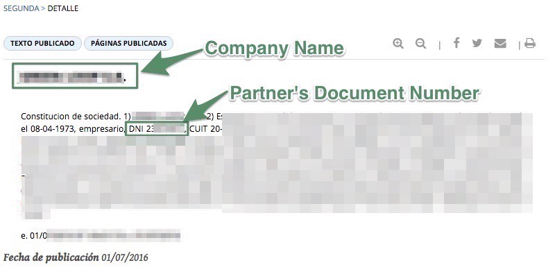
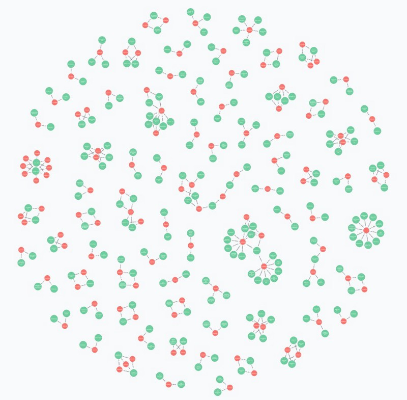
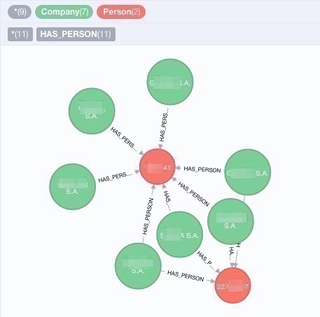

Inspired by the recent success of the Panama Papers investigation, and in an exercise to extend my skills, I set out to try to analyse Argentinian companies and their shareholders relationships.

I was already experienced in web scraping with other programming languages, but I had only done very little examples with [Scrapy](http://scrapy.org/). Python is not my first choice language, but I get around well enough.

[Neo4j](https://neo4j.com/) is a product that is difficult not to enjoy using. Since my first experiments, it has always surprised me with it’s easy of use, beautiful UI and its’s query language expressiveness ([Cypher!](https://en.wikipedia.org/wiki/Cypher_Query_Language)).

When a new firm is registered in Argentina or an existing one modifies it’s structure or composition, a notice must be published in the [Official Gazette (BORA)](https://www.boletinoficial.gob.ar/). This notice contains the company’s name and the names and details, such as document number, of the partners involved in the company.

The Scrapy project for BORA can be found [here](https://github.com/chrishein/bora_crawler).

[**chrishein/bora\_crawler**  
_bora\_crawler - BORA (Boletín Oficial de la Republica Argentina) Crawler implemented using Scrapy_github.com](https://github.com/chrishein/bora_crawler/blob/master/README.md "https://github.com/chrishein/bora_crawler/blob/master/README.md")

The spider that crawls each day and extracts content of each notice is simple.

I only used three months of BORA publications for my example, saving company names and the text contents into a JSON file.

Even though each notice must contain certain information, there is not a fixed structure of how it must be written, so extracting each person’s name proved to be a difficult task. I did some quick tests trying to use Named Entity Recognition, but street names kept being matched as persons. I guess I’ll have to use this as a excuse to broaden my knowledge in that are too.

To simplify the task, I decided to only extract document numbers and types using Ruby and [regular expressions](http://rubular.com/r/bfEtNpyjfM).

As a result, I ended up with a JSON file that could be easily imported into a local Neo4j instance.

I was finally ready to query the data, although I did not expect to do any outstanding discoveries with such a limited period of notice publications. But to my surprise, the very first query I executed gave my a quick visual representation of the relationships that caught my attention.

**Little clusters of limited people cross registering several companies in such a short period of time**. The one floating in the middle of the screen is shown below. I’m blurring the text to keep this post focused on the power of these tools, and not to transform it into a public judgement.

I did a Google search of the document number responsible for registering seven companies in a couple of months and the explanation was clear. Many news articles and investigation blog posts referred to this person as being used to register companies in behalf of other people under investigation for fraudulent activities. In some cases, the supposed actual owners of this companies have already been prosecuted.

Many of the clusters of registered companies produced the same outcome. Articles and accusations of companies suspected to be registered on behalf of renowned characters related to politics. Companies involved in money laundry schemes or known to be important government contractors.

This helps understand how important is is to be able to store and query information with a strong relationships representation, and how the way in which the results are visually presented may help uncover important hidden patterns.
